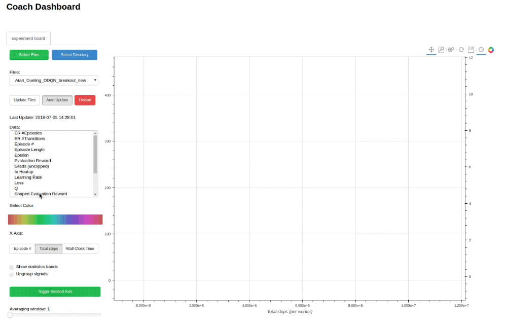

[](https://github.com/NervanaSystems/coach/blob/master/LICENSE)
[](https://nervanasystems.github.io/coach/)
[](https://doi.org/10.5281/zenodo.1134898)

##  Overview

Coach is a python reinforcement learning research framework containing implementation of many state-of-the-art algorithms.

It exposes a set of easy-to-use APIs for experimenting with new RL algorithms, and allows simple integration of new environments to solve. 
Basic RL components (algorithms, environments, neural network architectures, exploration policies, ...) are well decoupled, so that extending and reusing existing components is fairly painless.

Training an agent to solve an environment is as easy as running:

```bash
python3 coach.py -p CartPole_DQN -r
```

  

Blog posts from the Intel® AI website:
* [Release 0.8.0](https://ai.intel.com/reinforcement-learning-coach-intel/) (initial release)
* [Release 0.9.0](https://ai.intel.com/reinforcement-learning-coach-carla-qr-dqn/)

Contacting the Coach development team is also possible through the email [coach@intel.com](coach@intel.com)

## Table of Contents

- [Coach](#coach)
  * [Overview](#overview)
  * [Documentation](#documentation)
  * [Installation](#installation)
    + [Coach Installer](#coach-installer)
    + [TensorFlow GPU Support](#tensorflow-gpu-support)
  * [Usage](#usage)
    + [Running Coach](#running-coach)
    + [Running Coach Dashboard (Visualization)](#running-coach-dashboard-visualization)
  * [Supported Environments](#supported-environments)
  * [Supported Algorithms](#supported-algorithms)
  * [Citation](#citation)
  * [Disclaimer](#disclaimer)

## Documentation

Framework documentation, algorithm description and instructions on how to contribute a new agent/environment can be found [here](https://nervanasystems.github.io/coach/).


## Installation

Note: Coach has only been tested on Ubuntu 16.04 LTS, and with Python 3.5.

For some information on installing on Ubuntu 17.10 with Python 3.6.3, please refer to the following issue: https://github.com/NervanaSystems/coach/issues/54

### Coach Installer

Coach's installer will setup all the basics needed to get the user going with running Coach on top of [OpenAI Gym](https://github.com/openai/gym) environments.  This can be done by running the following command and then following the on-screen printed instructions:

```bash
./install.sh
```

Coach creates a virtual environment and installs in it to avoid changes to the user's system.

In order to activate and deactivate Coach's virtual environment:

```bash
source coach_env/bin/activate
```

```bash
deactivate
```

In addition to OpenAI Gym, several other environments were tested and are supported. Please follow the instructions in the Supported Environments section below in order to install more environments.

### TensorFlow GPU Support

Coach's installer installs [Intel-Optimized TensorFlow](https://software.intel.com/en-us/articles/intel-optimized-tensorflow-wheel-now-available), which does not support GPU, by default. In order to have Coach running with GPU, a GPU supported TensorFlow version must be installed. This can be done by overriding the TensorFlow version: 

```bash
pip3 install tensorflow-gpu==1.4.1
```

## Usage

### Running Coach

To allow reproducing results in Coach, we defined a mechanism called _preset_. 
There are several available presets under the `presets` directory.
To list all the available presets use the `-l` flag.

To run a preset, use:

```bash
python3 coach.py -r -p <preset_name>
```

For example:
* CartPole environment using Policy Gradients (PG):

  ```bash
  python3 coach.py -r -p CartPole_PG
  ```
  
* Basic level of Doom using Dueling network and Double DQN (DDQN) algorithm:

  ```bash
  python3 coach.py -r -p Doom_Basic_Dueling_DDQN
  ```

Some presets apply to a group of environment levels, like the entire Atari or Mujoco suites for example.
To use these presets, the requeseted level should be defined using the `-lvl` flag.

For example:


* Pong using the Nerual Episodic Control (NEC) algorithm:

  ```bash
  python3 coach.py -r -p Atari_NEC -lvl pong
  ```

There are several types of agents that can benefit from running them in a distrbitued fashion with multiple workers in parallel. Each worker interacts with its own copy of the environment but updates a shared network, which improves the data collection speed and the stability of the learning process.
To specify the number of workers to run, use the `-n` flag.

For example:
* Breakout using Asynchronous Advantage Actor-Critic (A3C) with 8 workers:

  ```bash
  python3 coach.py -r -p Atari_A3C -lvl breakout -n 8
  ```


It is easy to create new presets for different levels or environments by following the same pattern as in presets.py

More usage examples can be found [here](https://nervanasystems.github.io/coach/usage/index.html).

### Running Coach Dashboard (Visualization)
Training an agent to solve an environment can be tricky, at times. 

In order to debug the training process, Coach outputs several signals, per trained algorithm, in order to track algorithmic performance. 

While Coach trains an agent, a csv file containing the relevant training signals will be saved to the 'experiments' directory. Coach's dashboard can then be used to dynamically visualize the training signals, and track algorithmic behavior. 

To use it, run:

```bash
python3 dashboard.py
```





## Supported Environments

* *OpenAI Gym:*

    Installed by default by Coach's installer. The version used by Coach is 0.10.5.

* *ViZDoom:*

    Follow the instructions described in the ViZDoom repository -

    https://github.com/mwydmuch/ViZDoom

    The version currently used by Coach is 1.1.4.
    Additionally, Coach assumes that the environment variable VIZDOOM_ROOT points to the ViZDoom installation directory.

* *Roboschool:*

    Follow the instructions described in the roboschool repository - 

    https://github.com/openai/roboschool

* *GymExtensions:*

    Follow the instructions described in the GymExtensions repository -

    https://github.com/Breakend/gym-extensions

    Additionally, add the installation directory to the PYTHONPATH environment variable.

* *PyBullet:*

    Follow the instructions described in the [Quick Start Guide](https://docs.google.com/document/d/10sXEhzFRSnvFcl3XxNGhnD4N2SedqwdAvK3dsihxVUA) (basically just - 'pip install pybullet')

* *CARLA:*

    Download release 0.8.4 from the CARLA repository -

    https://github.com/carla-simulator/carla/releases

    Create a new CARLA_ROOT environment variable pointing to CARLA's installation directory.

    A simple CARLA settings file (```CarlaSettings.ini```) is supplied with Coach, and is located in the ```environments``` directory.

* *Starcraft:*

    Follow the instructions described in the PySC2 repository - 
    
    https://github.com/deepmind/pysc2
    
    The version used by Coach is 2.0.1
    
* *DeepMind Control Suite:*

    Follow the instructions described in the DeepMind Control Suite repository - 
    
    https://github.com/deepmind/dm_control
    
    The version used by Coach is 0.0.0


## Supported Algorithms


* [Deep Q Network (DQN)](https://www.cs.toronto.edu/~vmnih/docs/dqn.pdf)  ([code](agents/dqn_agent.py))
* [Double Deep Q Network (DDQN)](https://arxiv.org/pdf/1509.06461.pdf)  ([code](agents/ddqn_agent.py))
* [Dueling Q Network](https://arxiv.org/abs/1511.06581)
* [Mixed Monte Carlo (MMC)](https://arxiv.org/abs/1703.01310)  ([code](agents/mmc_agent.py))
* [Persistent Advantage Learning (PAL)](https://arxiv.org/abs/1512.04860)  ([code](agents/pal_agent.py))
* [Categorical Deep Q Network (C51)](https://arxiv.org/abs/1707.06887)  ([code](agents/categorical_dqn_agent.py))
* [Quantile Regression Deep Q Network (QR-DQN)](https://arxiv.org/pdf/1710.10044v1.pdf)  ([code](agents/qr_dqn_agent.py))
* [Bootstrapped Deep Q Network](https://arxiv.org/abs/1602.04621)  ([code](agents/bootstrapped_dqn_agent.py))
* [N-Step Q Learning](https://arxiv.org/abs/1602.01783) | **Distributed**  ([code](agents/n_step_q_agent.py))
* [Neural Episodic Control (NEC)](https://arxiv.org/abs/1703.01988)  ([code](agents/nec_agent.py))
* [Normalized Advantage Functions (NAF)](https://arxiv.org/abs/1603.00748.pdf) | **Distributed**  ([code](agents/naf_agent.py))
* [Policy Gradients (PG)](http://www-anw.cs.umass.edu/~barto/courses/cs687/williams92simple.pdf) | **Distributed**  ([code](agents/policy_gradients_agent.py))
* [Asynchronous Advantage Actor-Critic (A3C)](https://arxiv.org/abs/1602.01783) | **Distributed**  ([code](agents/actor_critic_agent.py))
* [Deep Deterministic Policy Gradients (DDPG)](https://arxiv.org/abs/1509.02971) | **Distributed**  ([code](agents/ddpg_agent.py))
* [Proximal Policy Optimization (PPO)](https://arxiv.org/pdf/1707.06347.pdf)  ([code](agents/ppo_agent.py))
* [Clipped Proximal Policy Optimization](https://arxiv.org/pdf/1707.06347.pdf) | **Distributed**  ([code](agents/clipped_ppo_agent.py))
* [Direct Future Prediction (DFP)](https://arxiv.org/abs/1611.01779) | **Distributed**  ([code](agents/dfp_agent.py))
* Behavioral Cloning (BC)  ([code](agents/bc_agent.py))


## Citation

If you used Coach for your work, please use the following citation:

```
@misc{caspi_itai_2017_1134899,
  author       = {Caspi, Itai and
                  Leibovich, Gal and
                  Novik, Gal},
  title        = {Reinforcement Learning Coach},
  month        = dec,
  year         = 2017,
  doi          = {10.5281/zenodo.1134899},
  url          = {https://doi.org/10.5281/zenodo.1134899}
}
```

## Disclaimer

Coach is released as a reference code for research purposes. It is not an official Intel product, and the level of quality and support may not be as expected from an official product. 
Additional algorithms and environments are planned to be added to the framework. Feedback and contributions from the open source and RL research communities are more than welcome.
